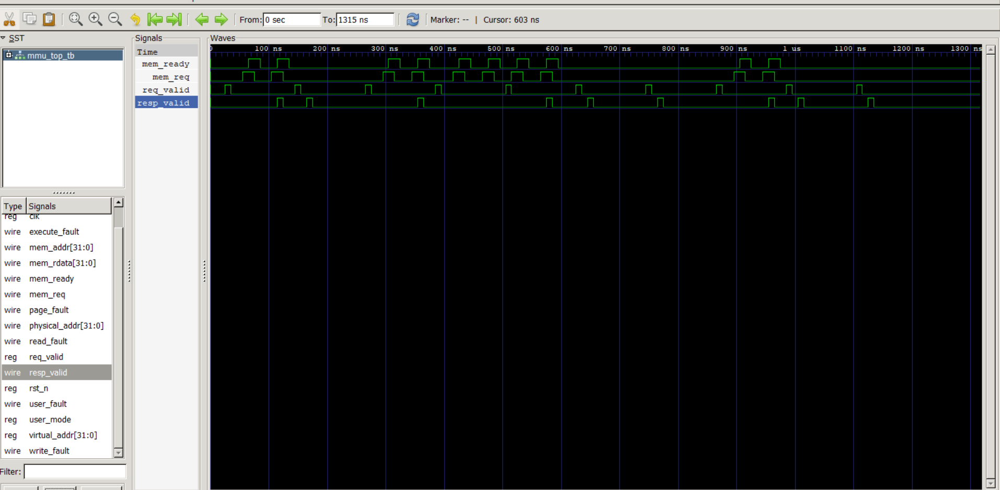
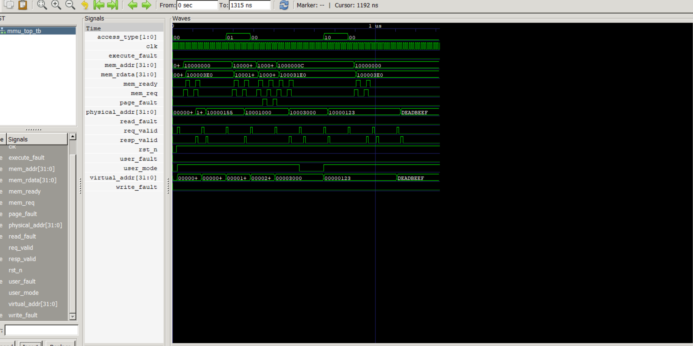

# Memory Management Unit (MMU) Design Using Verilog HDL

## Overview

This project implements a Memory Management Unit (MMU) using Verilog HDL. The design models key memory-management components commonly used in modern processors, including virtual-to-physical address translation, Translation Lookaside Buffer (TLB), Page Table Walker (PTW), permission checking, and Control Status Registers (CSR).

The MMU architecture is developed using a modular RTL design approach and verified through simulation using Icarus Verilog and waveform analysis using GTKWave.

---

## Key Features

* Virtual-to-Physical Address Translation
* Translation Lookaside Buffer (TLB)
* 4-Way Set Associative TLB
* Pseudo-LRU (PLRU) Replacement Policy
* Page Table Walker (PTW) FSM
* Permission Checking Logic
* CSR Register Interface
* Modular RTL Design
* Functional Verification
* GTKWave Waveform Analysis

---

## MMU Architecture

The MMU consists of the following major modules:

| Module               | Function                                 |
| -------------------- | ---------------------------------------- |
| mmu_top.v            | Top-level MMU integration                |
| tlb_4way_plru.v      | TLB implementation with PLRU replacement |
| ptw_fsm.v            | Page Table Walker finite state machine   |
| pt_memory_model.v    | Page table memory model                  |
| address_translator.v | Virtual-to-Physical address translation  |
| permission_checker.v | Access permission verification           |
| csr_registers.v      | Control and Status Registers             |

---

## Design Flow

```text
CPU Request
     │
     ▼
TLB Lookup
     │
     ├── TLB Hit ─────► Address Translation
     │
     └── TLB Miss
              │
              ▼
      Page Table Walker
              │
              ▼
      Page Table Memory
              │
              ▼
       Update TLB
              │
              ▼
      Physical Address
```

---

## Verification

The MMU was verified using a dedicated testbench:

```text
tb/mmu_top_tb.v
```

Verified Functionality:

* TLB Lookup Operations
* TLB Hit Handling
* TLB Miss Handling
* Page Table Walk Requests
* Virtual-to-Physical Address Translation
* Permission Validation
* Request/Response Transactions
* Fault Detection Logic

---

## Project Structure

```text
Memory-Management-Unit-MMU-Design-Using-Verilog-HDL
│
├── rtl
│   ├── mmu_top.v
│   ├── tlb_4way_plru.v
│   ├── ptw_fsm.v
│   ├── pt_memory_model.v
│   ├── address_translator.v
│   ├── permission_checker.v
│   └── csr_registers.v
│
├── tb
│   └── mmu_top_tb.v
│
├── waveforms
│   ├── mmu_request_response.png
│   └── mmu_translation_waveform.png
│
├── docs
├── reports
├── constraints
│
├── README.md
└── .gitignore
```

---

## Tools Used

* Verilog HDL
* Icarus Verilog
* GTKWave
* Digital Logic Design
* Computer Architecture Concepts

---

## Simulation Flow

### Compile

```bash
iverilog -o mmu_sim rtl/*.v tb/mmu_top_tb.v
```

### Run Simulation

```bash
vvp mmu_sim
```

### Open Waveform

```bash
gtkwave mmu.vcd
```

---

## Waveform Results

### MMU Request / Response Verification



### Address Translation Verification



---

## Learning Outcomes

Through this project, the following concepts were explored:

* Computer Architecture
* Memory Management Systems
* Translation Lookaside Buffers (TLB)
* Page Table Walking Mechanisms
* Access Permission Control
* Finite State Machines (FSM)
* RTL Design Methodology
* Functional Verification
* Waveform Debugging

---

## Future Enhancements

Potential improvements include:

* Multi-Level Page Table Support
* TLB Performance Statistics
* Larger Associativity Options
* Hardware Exception Handling
* Cache/MMU Integration
* FPGA Deployment
* Formal Verification

---

## Author

**Jatin Gujarathi**

Final Year B.Tech Student

Areas of Interest:

* VLSI Design
* FPGA Design
* RTL Design
* Functional Verification
* Computer Architecture

---

## Acknowledgement

Special thanks to **Umesh Yadav Sir** for his valuable guidance and support throughout the development of this project.
